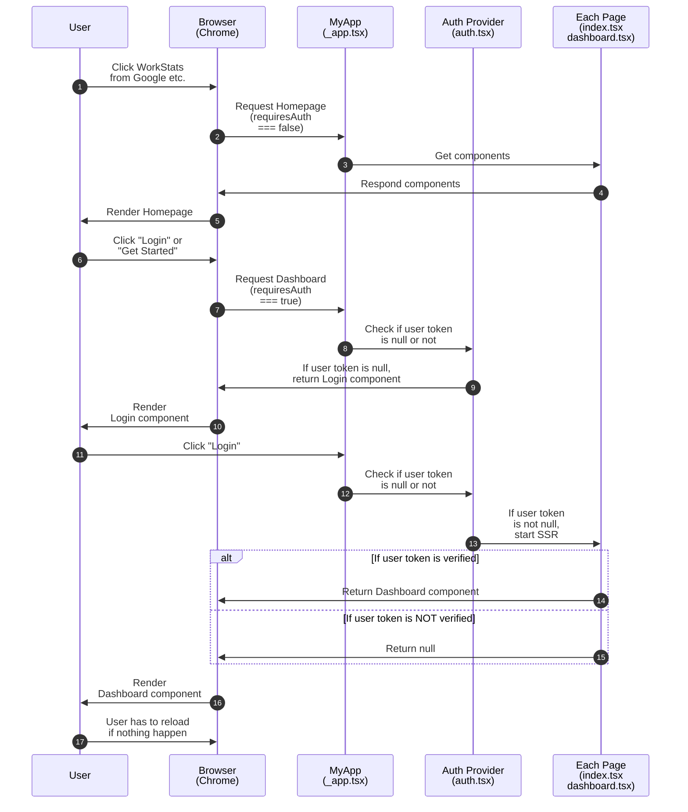

# Sequence diagram around login and authentication

## Sequence diagram

```mermaid
sequenceDiagram
  autonumber
  participant U as User
  participant B as Browser<br>(Chrome)
  participant MA as MyApp<br>(_app.tsx)
  participant AP as Auth Provider<br>(auth.tsx)
  participant EP as Each Page<br>(index.tsx<br>dashboard.tsx)
  U ->> B: Click WorkStats<br>from Google etc.
  B ->> MA: Request Homepage<br>(requiresAuth<br>=== false)
  MA ->> EP: Get components
  EP ->> B: Respond components
  B ->> U: Render Homepage
  U ->> B: Click "Login" or<br>"Get Started"
  B ->> MA: Request Dashboard<br>(requiresAuth<br>=== true)
  MA ->> AP: Check if user token<br>is null or not
  AP ->> B: If user token is null,<br>return Login component
  B ->> U: Render<br>Login component
  U ->> MA: Click "Login"
  MA ->> AP: Check if user token<br>is null or not
  AP ->> EP: If user token<br>is not null,<br>start SSR
  alt If user token is verified
    EP ->> B: Return Dashboard component
  else If user token is NOT verified
    EP ->> B: Return null
  end
  B ->> U: Render<br>Dashboard component
  U ->> B: User has to reload<br>if nothing happen
```